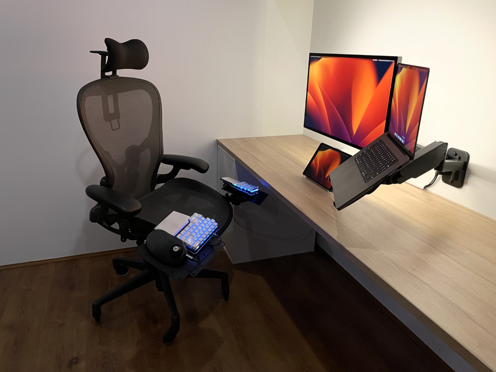
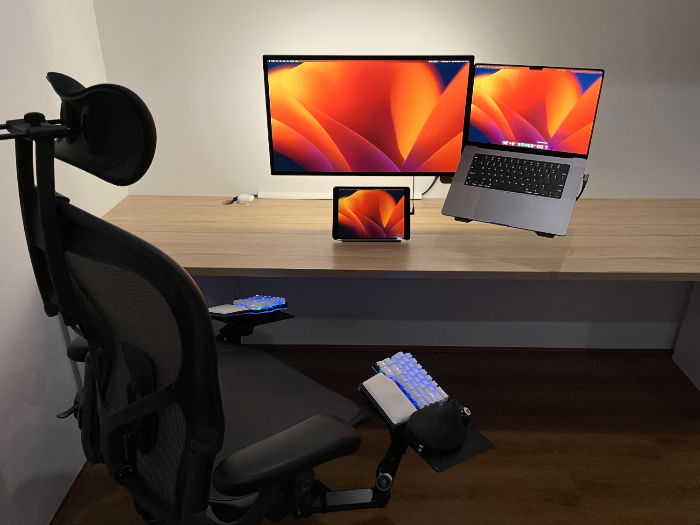

# Office Setup

Since working from home I've been refining my office setup with an emphasis on ergonomics. I'm a believer in investing in high quality tools to increase efficiency and make long sessions working and studying more enjoyable. Below is a breakdown of the equipment I'm currently using.

## Equipment

### Laptop: MacBook Pro

 The new ARM processors are serious workhorses and due to the high quality 16" retina display I use it as a secondary monitor.

### Monitor: Apple Studio Display

I spent a long time researching monitors before settling on the ASD. I was considering an ultrawide (Samsung G95NC or similar for the extra screen real estate) but ultimately ended up with the ASD for the following reasons:

1. The screen is only being used for productivity. I spend the majority of my time in a terminal or IDE so picture quality and text sharpness is of primary importance.
2. There are limited 5K/6K monitor options on the market. These high resolutions both look great but also allow macOS to scale efficiently.
3. When using the monitor with the MBP it wakes from sleep almost instantly, and you can control the monitor functions (brightness, volume) using the native macOS controls.
4. Integrated speakers, webcam, and 4 port dock. The speakers are great considering they are built into the monitor. The webcam not so much, but it's still fine for online meetings.
5. Apple support is second to none. I've heard nightmare stories trying to get support from Samsung, LG etc.

Before the ASD my monitor setup consisted of 2x 28" 4K Samsung monitors + MBP display. The reduction in screen real estate is a downside, but I have found less neck strain since removing the 28" side monitor. The upside is the ASD display quality is far superior. I have also added an iPad with sidecar for some additional screen real estate since using the ASD. I would consider upgrading to a 32" 6K display if a reasonable priced option becomes available.

On the rear of the ASD I've added a [LED light strip](https://www.amazon.com.au/PAUTIX-Dimmable-Backlight-Flexible-Lighting/dp/B0B1J57XS9?th=1) for back lighting. This provides excellent relief from eye strain during long sessions. I would recommend an adjustable LED strip as it allows the lights to be dimmed while working in the evening.

### Tablet: iPad 10.9"

As mentioned above, this is used with sidecar for extra screen real estate. Usually I'll keep Teams or Outlook open on the iPad. Being able to disconnect it at the end of the day and use it as a regular tablet is also a big benefit. I've found it's an invaluable tool for studying on the go (PDFs, Notion, Udemy etc). I'll likely be looking to upgrade to a 12.9" when the 2024 models are available.

> As a side note: I'm not a fan of Safari, but I've found synced tab groups to be very useful to maintain tab consistency across the laptop, tablet, and phone. The tab sync implementation I've seen on other browsers don't seem to be as good at maintaining open tabs or as quick to update tab state.

### Headphones: AirPods Pro

I've been using these since they were released in 2019. Active noise cancellation is a must when working from home or a busy office. The battery life, sound quality, and portability mean they are my go-to headphones for both work and study.

### Keyboard: Dygma Raise

I first stumbled across the Raise when researching ergonomic keyboards. Split keyboards allow the wrists and shoulders to be in a more natural and neutral position. I use the raise for the following reasons:

1. It uses a standard keyboard layout. I didn't want the pain of switching between something more custom like the Moonlander and a regular keyboard.
2. It has great software for customising keys, layers, and macros.
3. An OEM tenting kit is available which helps with ergonomics
4. Hot swappable mechanical switches. I originally ordered the Raise with Kailh Silent Browns. They weren't bad, but I've found my preference is for a silent tactile switch. I'm currently using [Outemu Cream yellows](https://www.aliexpress.com/item/1005004669940336.html) which is my favourite switch so far.

> For anyone starting with a split/ergo keyboard, I highly recommend [monkeytype](https://monkeytype.com) for getting your touch typing back up to speed. There's some great funbox modes which can hit any weak points in your typing game. I personally like the wiki mode which gives a more real-world typing test.

### Trackball: Ploopy Classic

Due to my [HOTAS](https://en.wikipedia.org/wiki/HOTAS) inspired keyboard & chair setup I had to use a trackpad or trackball. I did initially test the Magic Trackpad, but I found it inefficient and slow for mouse heavy tasks. When researching trackballs, I found the Ploopy had some excellent reviews praising both it's build quality (high quality switches) and ergonomics. The design is essentially an upgraded replica of the Microsoft Trackball Explorer. This is my first trackball and I'm now a convert, using it both at home and in the office. MacOS SteerMouse is a must when using a trackball as it allows you to customise everything about the device, as well as add per app behaviour and macros. Autoscroll is also a game changer as it enables 2D scrolling using the trackball when a button is held down. SteerMouse will allow you to adjust the autoscroll scrolling speed independent of the standard mouse cursor speed.

### Chair: Hermon Miller Aeron

Remastered edition size C with the aftermarket Atlas headrest and rollerblade wheels. Aerons are a gold standard in the ergonomic chair world due to their level of customisation. I found the post in this [Reddit thread](https://www.reddit.com/r/Ergonomics/comments/q6xmju/ive_been_having_a_lot_of_neck_and_back_pain_im/) by a HM product manager to be the most useful explanation of how to properly set up the chair. I typically use it with the tilt adjuster unlocked (for that floating feeling) in a 90 degree upright task based position. The only time I use the headrest to support my head is on the odd occasion I'm leaning back in the chair, the rest of the time I use it as a guide to feel where my head and neck should be to try and limit [forward head posture](https://www.physio-pedia.com/Forward_Head_Posture).

I use the following components for the HOTAS inspired keyboard mount setup:

- 2x [Bracket Pole Mount Double Arm](https://au.element14.com/pro-signal/1290b/bracket-pole-mount-double-arm/dp/278225201?st=bracket%20pole%20mount%20double%20arm)
- 2x [Steel VESA TV mount bracket](https://www.amazon.com.au/dp/B07MJTJ6T4?ref_=pe_19115062_429603572_302_E_DDE_dt_1&th=1)

This [Reddit thread](https://www.reddit.com/r/hotas/comments/mmmyp2/herman_miller_aeron_diy_mounts_with_quick_release/) provides the details on how to assemble.

Prior to this setup I did try using an adjustable keyboard tray, but I found it didn't provide the level of customisation needed. Ergonomics need to be tailored for the individuals body type and limb proportions. Having longer arms and a relatively short torso I found my legs would be touching the underside of a traditional tray or desk, but my forearms and wrists would still have to angle upwards putting pressure on the ulnar nerve in the forearm. With a split keyboard on the above mounts I can use the keyboard in a tented position slightly lower than the Aeron's arm rests. This allows the chest to open up, the shoulders & upper back to sit against the chair back, and the arms to remain in a supinator position with forearms aligned with the wrists. In this position, the arms and wrists are floating above the keyboard with the keys directly below the fingertips. I've made many minor adjustments to the angles and heights of the monitor arms and brackets over time, but I believe it's worth thinking about when you're spending a significant portion of your working life seated at a computer.

### Monitor Mount: Brateck dual wall mount

The desk is flush with the wall (it's an IKEA kitchen benchtop) so I use a Brateck dual wall mounted monitor arm (17"-32"). Installed on one of the arms is a [VESA laptop tray holder](https://www.ebay.com.au/itm/174574651488) which holds the MPB.
